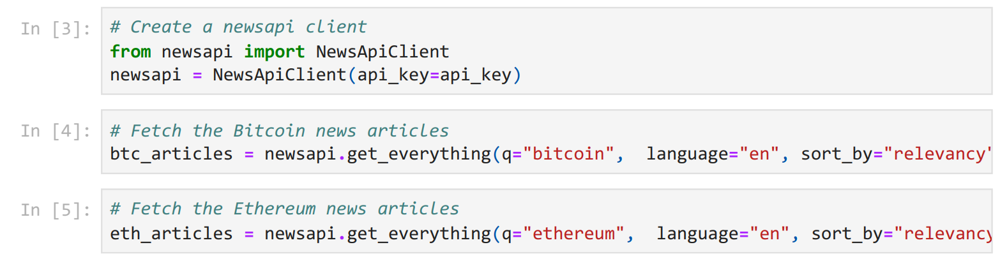
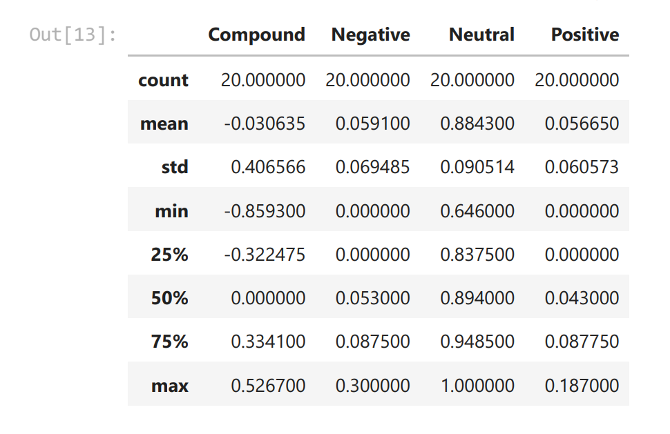
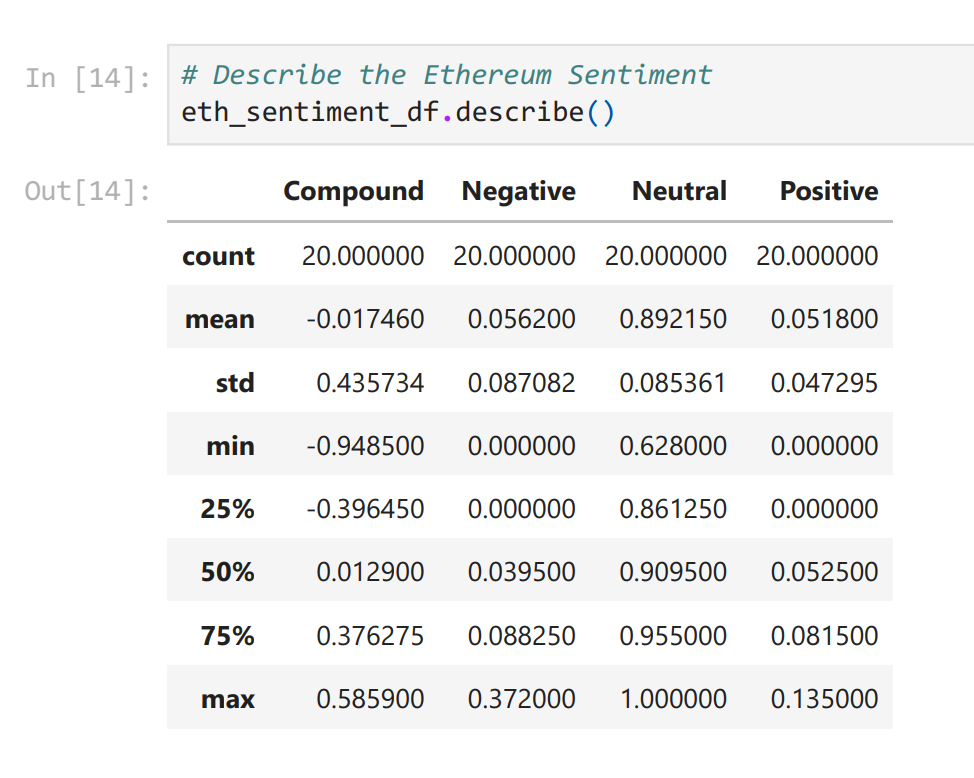
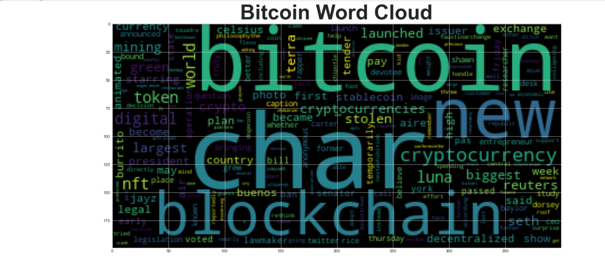
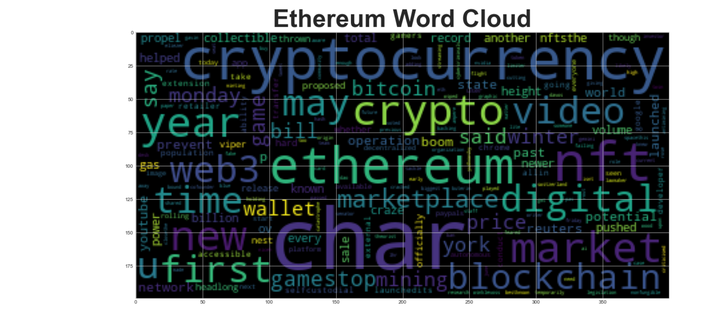

)

## Background

There's been a lot of hype in the news lately about cryptocurrency, so you want to take stock, so to speak, of the latest news headlines regarding Bitcoin and Ethereum to get a better feel for the current public sentiment around each coin.

In this assignment, you will apply natural language processing to understand the sentiment in the latest news articles featuring Bitcoin and Ethereum. You will also apply fundamental NLP techniques to better understand the other factors involved with the coin prices such as common words and phrases and organizations and entities mentioned in the articles.

I did the following tasks:

1. [Sentiment Analysis](#1---Sentiment-Analysis)
2. [Natural Language Processing](#2---Natural-Language-Processing)
3. [Named Entity Recognition](#3---Named-Entity-Recognition).

Using Jupyter Notebook [crypto sentiment]([crypto_sentiment.ipynb](https://github.com/joannemannuella/-crypto-sentimental-analysis-NLP/blob/main/crypto_sentiment.ipynb)) and run following:

1. Sentiment Analysis

Using [Vader Sentiment Analysis package](https://www.nltk.org/howto/sentiment.html)

Using newsapi to retrive the latest news articles for Bitcoin and Ethereum, using the information to create a DataFrame of sentiment scores for each coin.

Sentiment Score Analysis

**Bitcoin Metric**

**Ethereum Metric**

Use descriptive statistics to answer the following questions:
1. Which coin had the highest mean positive score?

**Bitcoin 0.056650**

2. Which coin had the highest negative score?

**Ethereum 0.372000**

3. Which coin had the highest positive score?

**Bitcoin 0.187000**

2. Natural Language Processing - Natural Language Toolkit - NTLK

**a.Tokenizing Words & Sentences - Tokenizing**

 1. Using NLTK libraries
 2. Using NLTK and Python to tokenize the text for each coin:
    * Removing Punctuation
    
    * lowercased each words
    
    * Removing stop words
    
    * Lemmatize words
    

**b. Generate N-Grams - Ngrams**

**c. Generate Word Cloud - WordCloud**

 1. Bitcoin
 
 
 
 2. Ethereum
 
 

3.Named Entity Recognition - spaCy

    *Named Entity Recognition - NER
    
    *Visualizers - Displacy

**[PDF file for better visualisation](https://github.com/joannemannuella/-crypto-sentimental-analysis-NLP/blob/main/crypto_senti%E2%80%A6%20(2)%20-%20JupyterLab.pdf)**
